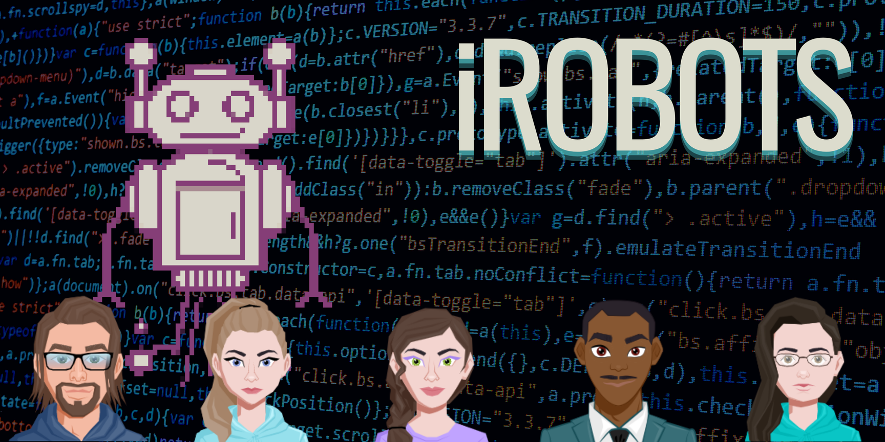

# t06 - iRobots

| Last Name | First Name | CSU eName | GitHub Username | CSU Email | Development Environment |
| --- | --- | --- | --- | --- | --- |
| McFall | John | jmcf521 | jmcf521 | jmcf521@colostate.edu | VSCode with Docker |
| Hall | Rachel | rshall | rsiena6 | rshall@rams.colostate.edu | VSCode with Docker |
| Swift | Caitlin | csswift | csswift | csswift@colostate.edu | vsCode with RemoteSSH |
| Diarrassouba | Hinzan | hinzan | hinzan-d | hinzan@colostate.edu | VSCode |
| Petrucci | Kat | kpetru | froggy-time | kpetru@colostate.edu | VS Code with Docker |

Our team will be using Slack to communicate with each other daily and we will hold meetings on Microsoft Teams when we need to get together and talk about our project. We will have a set meeting time at 1pm on Sundays every week for our team to talk and work together on the product. At 1pm the day a project is due we as a team will check in on Slack to make sure everyone is able to get the tasks assigned to them done in time.

The expectation on what we will accomplish this semester is to gain more team skills and as a team to build a functioning web app that we are all proud of and can use for our resumes. We also will focus on communicating with others and making sure our voices are all heard. We will work to make the project look good in the eyes of the team and individuals.

The expectation is that each team member will put in an equal amount of work/effort for each task. Each team member should contribute at least 5 hours a week towards the product, or more if necessary.
